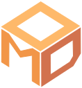
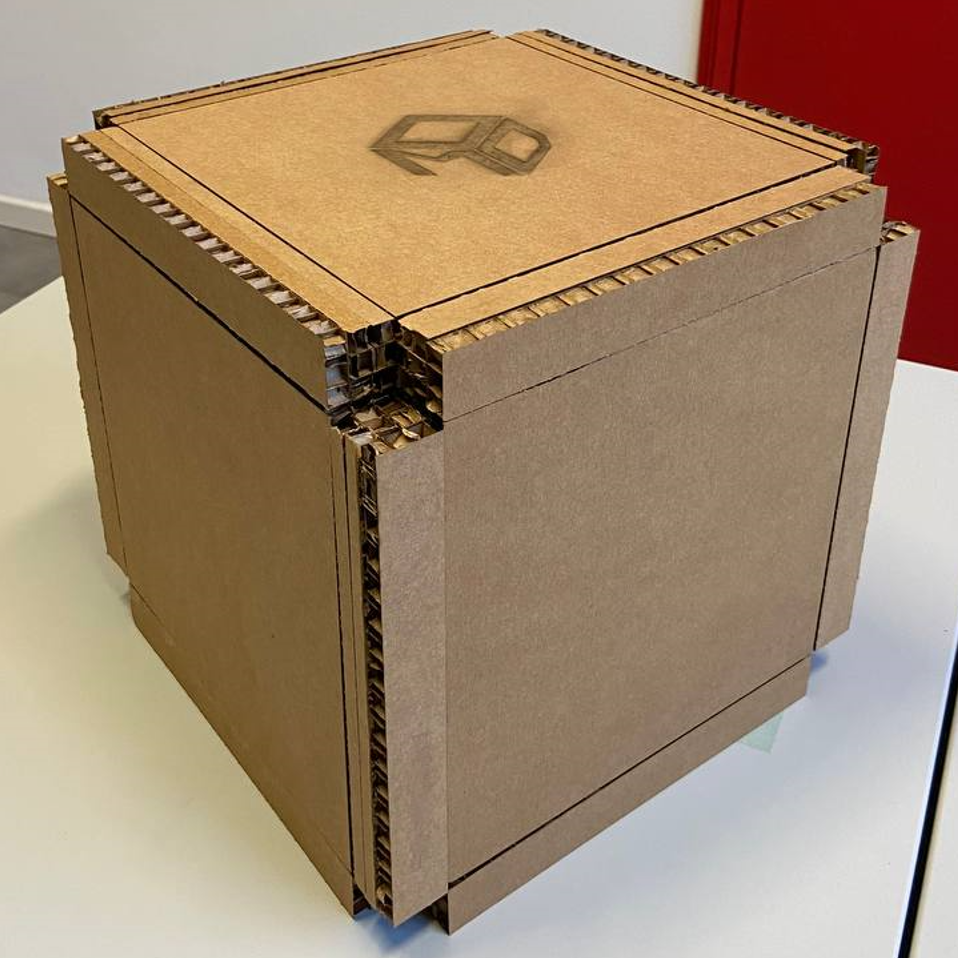
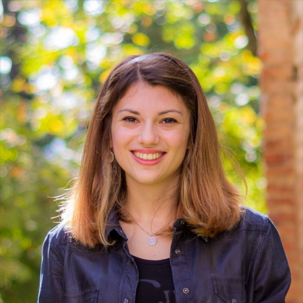
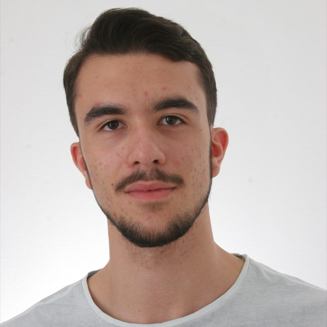

[![License][license-shield]][license-url]
[![Downloads][downloads-shield]][downloads-url]
[![Stars][stars-shield]][stars-url]
[![Moddularity][moddularity-shield]][moddularity-url]\
[![c#][c#-shield]][c#-url]
[![Unity][unity-shield]][unity-url]
[![Figma][figma-shield]][figma-url]

 

 

<h1>Moddy: more than just a box.</h1>

Moddy is the project of our team Pack-a-Punch, created for the ***Project Challenge 2022*** of the course [Innovation and Project Management M](https://www.unibo.it/en/teaching/course-unit-catalogue/course-unit/2022/468071). It consists of a *modular* box, whose modules can be assembled to obtain various types of objects.

<a href="./resources/documents/ReportModdy_Pack-a-Punch.pdf">Report (IT)</a>
·
<a href="./resources/documents/Presentazione_Moddy_Statica.pdf">Presentation (IT)</a>
·
<a href="./resources/images/Ranking.png">Ranking</a>
·
<a href="https://linktr.ee/mymoddy">LinkTree</a>
·
<a href="https://github.com/GIP22-Pack-a-Punch/Moddy/releases/latest">Download App</a>
·
<a href="./README.it.md">Italiano <kbd></kbd></a>

	

### IPM Challenge 2022 ⚡
- **Task**: Design an interactive object.
- **Topic**: Intelligent packaging, goods or food transport system.

More information about the challenge are available in [this pdf (IT)](./resources/documents/GIP-M_Challenge_2022.pdf).

#### Results 🏆
Our team classified ***first*** 🥇 out of 14 teams 🎉, after being evaluated by a commission of experts in the field of innovation:
- [Daniela Dubla](https://www.linkedin.com/in/daniela-dubla-6639797/) (MindsettER)
- [Gianluca Cristallo](https://www.linkedin.com/in/gianluca-cristallo-35992925/) (Camst)
- [Luca Cerati](https://www.linkedin.com/in/luca-cerati-a1932b35/) (Coesia)
- Marco Ghini (Coesia)
- [Maria Cecilia Flores](https://www.linkedin.com/in/maria-cecilia-flores-coluccio/) (UNIBO-KTO)

### The Product 💡
<table>
  <tr align="center">
    <td></td>
    <td></td>
  </tr>
  <tr align="center">
    <td>Moddy Box 📦</td>
    <td>MyModdy App 📱💻</td>
  </tr>
</table>

<!--
### Presentation 👨‍🏫

  
   
	Presentation Video (IT)

-->

### Call for Startup 🚀 <!-- 🦄 -->
Our project was ***selected*** as emerging idea for the [Call for Startup 2023](https://site.unibo.it/idea/it/la-nostra-idea/attivita-e-iniziative/call-for-start-up), classified ***19°*** 🎯 on a total of 97 projects 🎉.

### Deadline 📅
- 07/11/2022 - Individual Revision (Project Idea Presentation)
- 30/11/2022 - Pitch Presentation Test
- 12/12/2022 - Official Project Presentation
- 19/12/2022 - Report Submission
- 22/12/2022 - First IPM M Exam Date
- 27/01/2023 - Call for Startup 2023 Registration Deadline (14:00)
- 27/02/2023 - Call for Startup 2023 Ranking Release

### Roadmap 📍

- [ ] App MyModdy
  - [ ] Menu Scene
    - [ ] Lateral Menu
    - [ ] Moddy Scan (NFC)
    - [ ] Detail View MyModdies (inventario)
    - [ ] Settings View
    - [ ] About View
    - [ ] Help View
  - [ ] Builder Scene
    - [ ] Object clipping so it cannot leave the environment
    - [ ] Separated controls (slider or sphere with 3 arcs) to rotate/translate the object inside the scene
    - [ ] Drag & drop pieces or adding by click (easier to implement)
    - [ ] Cardboard texture for pieces
    - [ ] Generate Moddy View (loading GIF/SVG -maybe Moddy logo that builds- while the AI is generating the possible boxes)
    - [ ] Neural Network or AI to generate boxes (Check out Unity reinforcement learning(?))
- [ ] Website (github.io)

### Team 👥
<table>
  <tr align="center">
    <td></td>
    <td></td>
    <td></td>
    <td></td>
    <td></td>
    <td></td>
  </tr>
  <tr align="center">
    <td><b>Federico Andrucci</b></td>
    <td><b>Karina Chichifoi</b></td>
    <td><b>Alex Gianelli</b></td>
    <td><b>Lorenzo Righi</b></td>
    <td><b>Michele Righi</b></td>
    <td><b>Francesco Paglia</b></td>
  </tr>
  <tr align="center">
    <td>
      
      
    </td>
    <td>
      
      
    </td>
    <td>
      
      
    </td>
    <td>
      
      
    </td>
    <td>
      
      
      
    </td>
    <td>
      
      
    </td>
  </tr>
</table>

### Credits 🙏
- Best website to create GIFs: [EzGIF](https://ezgif.com/).
- Icons provided by: [Icons8](https://icons8.com/) and [Flaticon](https://www.flaticon.com/).

<!-- TO-DO: autografo professoressa + classifica -->

[unity-shield]: https://img.shields.io/badge/Unity-000000?logo=unity&logoColor=white
[unity-url]: https://unity.com/
[figma-shield]: https://img.shields.io/badge/Figma-F24E1E?logo=figma&logoColor=white
[figma-url]: https://www.figma.com/
[c#-shield]: https://img.shields.io/badge/C%23-%23239120.svg?logo=c-sharp&logoColor=white
[c#-url]: https://docs.microsoft.com/en-us/dotnet/csharp/

[downloads-shield]: https://img.shields.io/github/downloads/GIP22-Pack-a-Punch/Moddy/total
[downloads-url]: https://github.com/GIP22-Pack-a-Punch/Moddy/releases/latest
[license-shield]: https://img.shields.io/github/license/GIP22-Pack-a-Punch/Moddy
[license-url]: https://github.com/GIP22-Pack-a-Punch/Moddy/blob/main/LICENSE
[stars-shield]: https://custom-icon-badges.herokuapp.com/github/stars/GIP22-Pack-a-Punch/Moddy?logo=star&logoColor=yellow&style=flat
[stars-url]: https://github.com/GIP22-Pack-a-Punch/Moddy/stargazers

[moddularity-shield]: https://custom-icon-badges.herokuapp.com/badge/moddularity-100%25-salmon?logo=moddy
[moddularity-url]: https://github.com/GIP22-Pack-a-Punch/Moddy
